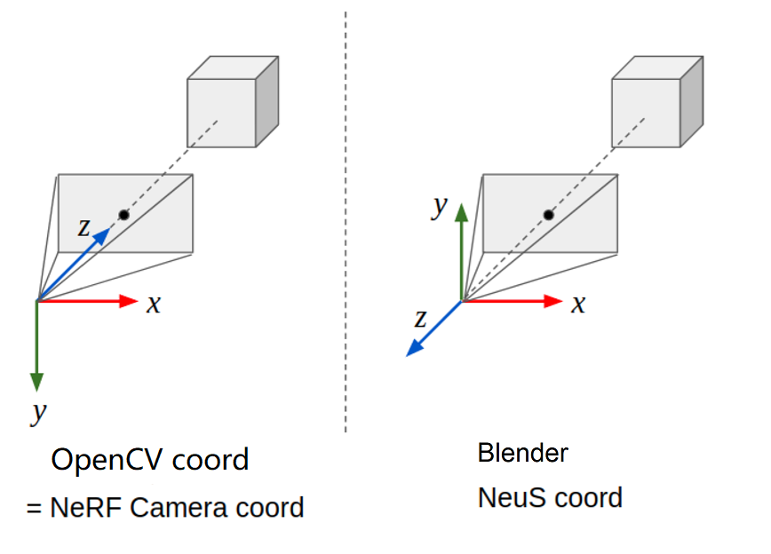

# ***Structure from Duplicates**: Neural Inverse Graphics from a Pile of Objects*

NeurIPS 2023  ·  Tianhang Cheng, Wei-Chiu Ma, Kaiyu Guan, Antonio Torralba, Shenlong Wang

[**Project Page**](https://tianhang-cheng.github.io/SfD-project.github.io/) | [**Paper**](https://tianhang-cheng.github.io/assets/pdf/dup_v3.pdf) | **Full Dataset**

## Preparation

Install pytorch 1.12 or higher version

```bash
conda create -n sfd python=3.9
conda activate sfd
pip install torch==1.12.1+cu116 torchvision==0.13.1+cu116 torchaudio==0.12.1 --extra-index-url https://download.pytorch.org/whl/cu116
```
Install other dependencies
```bash
pip install -r requirements.txt
```

The sample dataset is included in /data

## Training

Take ```airplane``` as example, we train the network in 3 stages:

### Stage 1: Train geometry network (~10 hour)
```bash
python exp_runner.py \
  --conf configs/default.yaml \
  --data_split_dir /data/airplane \
  --expname airplane \
  --trainstage Geo \
  --use_pretrain_normal \
  --init_method SFM
```

### Stage 2: Train visibility network (~30 minutes)

```bash
python exp_runner.py \
  --conf configs/default.yaml \
  --data_split_dir /data/airplane \
  --expname airplane \
  --trainstage Vis \
  --init_method SFM
```

### Stage 3: Train material network (~1 hour)

```bash
python exp_runner.py \
  --conf configs/default.yaml \
  --data_split_dir /data/airplane \
  --expname airplane \
  --trainstage Mat \
  --init_method SFM
```

Note for command: 
+ **--is_continue** : load from previous checkpoint
+ **--use_pretrain_normal** : add normal constrain from [MonoSDF](https://github.com/autonomousvision/monosdf). Model performance may decrease when pretrained normal has 
bad quality.
+ **--debug**: forbid visualization and run experiment in low sample numbers.
## TODO
**[√]** release training code\
**[√]** release sample data\
**[ ]** release eval code\
**[ ]** release full dataset\
**[ ]** release pre-process code\
**[ ]** release pretrained weight
**[ ]** extract mesh and texture from network

## Others

### Coordinate System



### OOM
You can decrease ```geo_num_pixels```, ```vis_num_pixels``` or ```mat_num_pixels``` if out of memory

### Visualization of Geometry Stage


## Acknowledgements
part of our code is inherited from [InvRender](https://github.com/zju3dv/InvRender). We are grateful to the authors for releasing their code.

## Citation
```
@inproceedings{cheng2023structure,
  title={Structure from Duplicates: Neural Inverse Graphics from a Pile of Objects},
  author={Cheng, Tianhang and Ma, Wei-Chiu and Guan, Kaiyu and Torralba, Antonio and Wang, Shenlong},
  booktitle={Thirty-seventh Conference on Neural Information Processing Systems},
  year={2023}
}
```