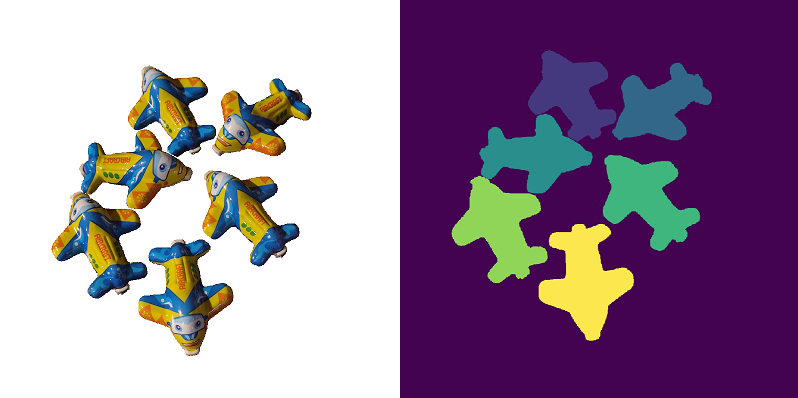
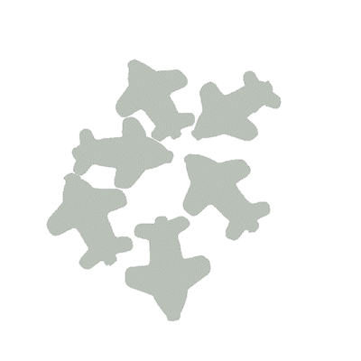
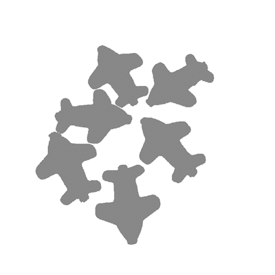
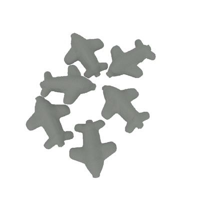

# ***Structure from Duplicates**: Neural Inverse Graphics from a Pile of Objects*

[**Project Page**](https://tianhang-cheng.github.io/SfD-project.github.io/) | [**Paper**](https://tianhang-cheng.github.io/assets/pdf/dup_v3.pdf) | [**ArXiv**](https://arxiv.org/abs/2401.05236) | **Full Dataset**

## Preparation

Install pytorch 1.12 or higher version

```bash
conda create -n sfd python=3.9
conda activate sfd
pip install torch==1.12.1+cu116 torchvision==0.13.1+cu116 torchaudio==0.12.1 --extra-index-url https://download.pytorch.org/whl/cu116
```
Install other dependencies
```bash
pip install -r requirements.txt
```

The sample dataset is included in /data
The model works in both Linux and Windows

## Data Preprocessing

Tips:
1. Currently we assume all instances can contribute to the reconstruction. If some instances failed during SfM, then the preprocessing pipeline will not work. You could manully mask those failed images and re-run preprocessing. Future version will consider this situation.
2. The original image should have big enough resolution, otherwise there may not enough keypoints for SfM.

### Where to put your image

Create a new folder in /data to put custom input, like /data/your_object. Then create a /data/your_object/train folder.
Put your RGB image and instance segmentation image in /data/your_object/train and rename them as "000_color.png" and "000_instance_seg.png".

The folder structure will be:
```
/data
  /airplane
  /your_object
    /raw
      -000_color.png
      -000_instance_seg.png
```
The instance seg can be obtained from Segment-anything (not provide here) or manual segmentation.
Its background should be 0, then the value of each instance area is 1/N×255, 2/N×255, 3/N×255, ..., N/N×255, where N is instance numbers.

### Preprocessing flow

0: crop each instance from the original image
1: find keypoints and match them for each pair
2-4: turn pair-wise matching to global matching
5: sfm
6-7: visualize and dump pose
8: dump surface normal from pretrained network

For 5_sfm, please install [colmap](https://github.com/colmap/pycolmap) by 'pip install pycolmap==0.6.1'

For 8_extract_monocular_cues.py, you should download the weight from [Omnidata](https://github.com/EPFL-VILAB/omnidata) and put the pretrained normal prediction network "omnidata_dpt_normal_v2.ckpt" to /preprocess/omnidata/omnidata_tools/torch/pretrained_models.

### Start processing

First set the value to your own object

object_name = 'your_object' # set a name, same as folder name
instance_num = 6 # number of instances in the image. Change it to the actual number of instances in the image

Then run script:

```
cd preprocess
python run.py
```

Then the training data will appear in /data/your_object

## Training

Take ```airplane``` as example, we train the network in 3 stages. The checkpoints will generate under /exps.

### Stage 1: Train geometry network (~10 hour)
```bash
python exp_runner.py \
  --conf configs/default.yaml \
  --data_split_dir ./data/airplane \
  --expname airplane \
  --trainstage Geo \
  --use_pretrain_normal \
  --init_method SFM
```

### Stage 2: Train visibility network (~30 minutes)

```bash
python exp_runner.py \
  --conf configs/default.yaml \
  --data_split_dir ./data/airplane \
  --expname airplane \
  --trainstage Vis \
  --init_method SFM
```

### Stage 3: Train material network (~1 hour)

```bash
python exp_runner.py \
  --conf configs/default.yaml \
  --data_split_dir ./data/airplane \
  --expname airplane \
  --trainstage Mat \
  --init_method SFM
```

Note for command: 
+ **--is_continue** : load from previous checkpoint
+ **--use_pretrain_normal** : add normal constrain from [MonoSDF](https://github.com/autonomousvision/monosdf). Model performance may decrease when pretrained normal has 
bad quality.
+ **--debug**: forbid visualization and run experiment in low sample numbers.
## TODO
**[√]** release training code\
**[√]** release sample data\
**[ ]** release eval code\
**[ ]** release full dataset\
**[√]** release pre-process code\
**[ ]** release pretrained weight\
**[ ]** extract mesh and texture from network

## Others

### Coordinate System


### OOM
You can decrease ```geo_num_pixels```, ```vis_num_pixels``` or ```mat_num_pixels``` if out of memory

### Training Visualization

#### Input 



Image | Instance mask

#### Geometry Stage

<table><tr>
<td></td>
<td></td>
<td></td>
</tr></table>

Appearence (500iter/frame) | Surface Normal (500iter/frame) | Rendering Error (500iter/frame)

#### Material Stage

<table><tr>
<td></td>
<td></td>
<td></td>
</tr></table>

Diffuse (1000iter/frame) | Roughness (1000iter/frame) | Rerender (1000iter/frame)

## Acknowledgements
part of our code is inherited from [InvRender](https://github.com/zju3dv/InvRender). We are grateful to the authors for releasing their code.

## Citation
```
@inproceedings{cheng2023structure,
  title={Structure from Duplicates: Neural Inverse Graphics from a Pile of Objects},
  author={Cheng, Tianhang and Ma, Wei-Chiu and Guan, Kaiyu and Torralba, Antonio and Wang, Shenlong},
  booktitle={Thirty-seventh Conference on Neural Information Processing Systems},
  year={2023}
}
```