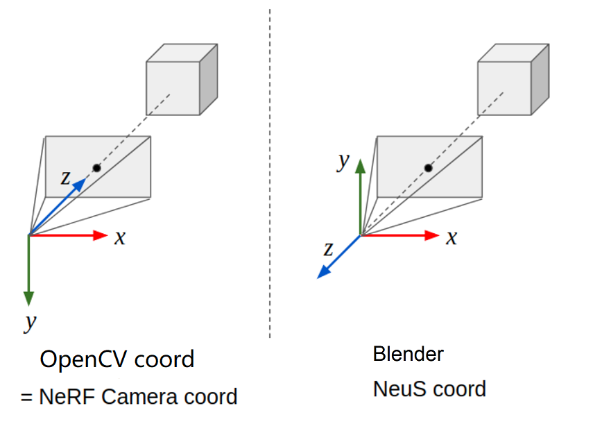
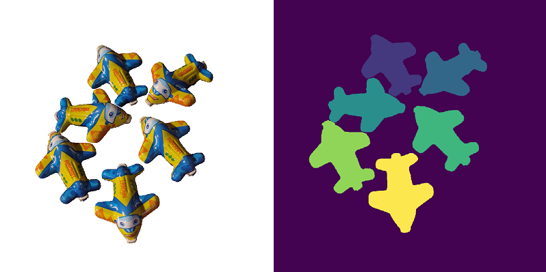
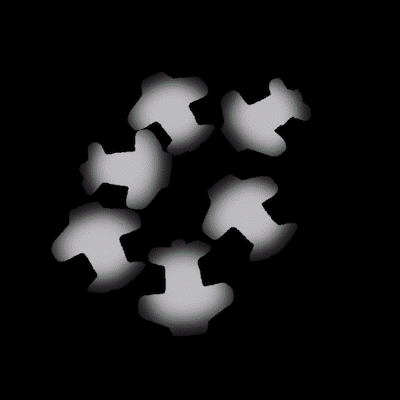
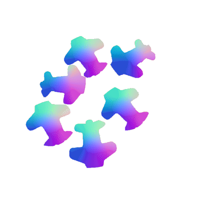
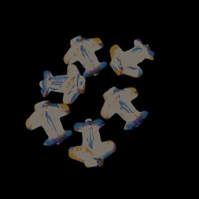
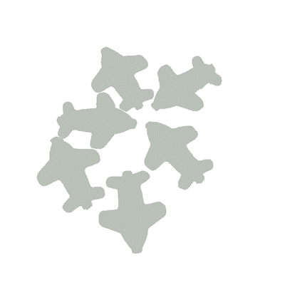
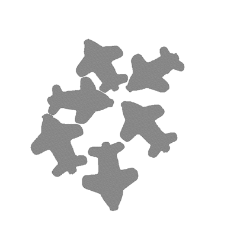
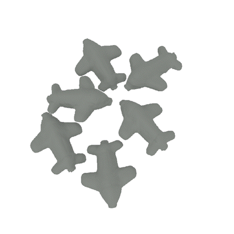

# ***Structure from Duplicates**: Neural Inverse Graphics from a Pile of Objects*

[**Project Page**](https://tianhang-cheng.github.io/SfD-project.github.io/) | [**Paper**](https://tianhang-cheng.github.io/assets/pdf/dup_v3.pdf) | [**ArXiv**](https://arxiv.org/abs/2401.05236) | [**Full Dataset**](https://huggingface.co/datasets/TianhangCheng7/DuplicateSingleImage) | [**Blender Scenes**](https://huggingface.co/datasets/TianhangCheng7/DuplicateBlenderData) | [**Weights**](https://huggingface.co/TianhangCheng7/DuplicateWeight) | [**Results**](https://tianhang-cheng.github.io/SfD/)

Recover shape, material and lighting from a **single image of many copies of one object**. The
duplicates act as multiple views: preprocessing recovers their relative poses with SfM, then three
training stages fit a shared SDF + BRDF + environment light.

## Contents

- [Installation](#installation) · [Quick start](#quick-start)
- [Data preprocessing](#data-preprocessing) — turn your own image into a trainable folder
- [The DuplicateSingleImage dataset](#the-duplicatesingleimage-dataset) — download & layout
- [Training](#training) · [Evaluation](#evaluation)
- [Exporting mesh and texture](#exporting-mesh-and-texture)
- [Comparing with the Blender ground truth](#comparing-with-the-blender-ground-truth)
- [Batch training & evaluation](#batch-training--evaluation-cmd_trainsh--cmd_evalsh)
- [Troubleshooting](#troubleshooting) · [Gallery](#gallery) · [Citation](#citation)

Works on Linux and Windows.

## Installation

Install PyTorch 1.12 or newer (matching pytorch-lightning versions are listed
[here](https://lightning.ai/docs/pytorch/latest/versioning.html#pytorch-support)):

```bash
conda create -n sfd python=3.9
conda activate sfd
pip install torch==1.12.1+cu116 torchvision==0.13.1+cu116 torchaudio==0.12.1 --extra-index-url https://download.pytorch.org/whl/cu116
pip install -r requirements.txt

# optional, only for the normal prior from a pretrained model
pip install pytorch-lightning==1.7.1

# needed by the SfM stage of preprocessing
pip install pycolmap==0.6.1   # newer wheels work too; tested on 0.6.1 and 4.1.1
```

Then pull the large binaries — this repository only tracks code:

```bash
python download_assets.py
```

<details>
<summary><b>What <code>download_assets.py</code> fetches, and what other libraries download on their own</b></summary>

| what | where it lands | size | from |
| --- | --- | --- | --- |
| SuperPoint / SuperGlue checkpoints | `preprocess/keypoint_matching/weights/` | 92 MB | [TianhangCheng7/DuplicateWeight](https://huggingface.co/TianhangCheng7/DuplicateWeight) |
| `b`/`c`/`d` HDRI environment maps | `envmaps/*.exr` | 57 MB | [TianhangCheng7/DuplicateBlenderData](https://huggingface.co/datasets/TianhangCheng7/DuplicateBlenderData) |

Fetch one group at a time with `--weights` / `--envmaps`, and re-download with `--force`. If you
skip the script the code downloads what it needs on first use anyway — SuperPoint/SuperGlue when the
matcher is built, and an `.exr` when the `Mat` stage or `envmaps/fit_envmap_with_sg.py` opens it.

One more checkpoint is fetched by another library, so the training machine needs outbound network
access once (or a warm cache):

| what | where it lands | size | from |
| --- | --- | --- | --- |
| torchvision VGG16 (the LPIPS backbone) | `~/.cache/torch/hub/checkpoints/` | 528 MB | [download.pytorch.org](https://download.pytorch.org/models/vgg16-397923af.pth) |

LPIPS is only used when validation images are plotted and in `--eval`, but it is computed at
iteration 0, so a machine that cannot reach `download.pytorch.org` fails early in training.

The Omnidata monocular-cue checkpoint is **not** included — see
[Stage 8: Omnidata surface normals](#stage-8-omnidata-surface-normals).

</details>

## Quick start

Train on one ready-made object from the released dataset (no preprocessing needed):

```bash
pip install -U huggingface_hub
hf download TianhangCheng7/DuplicateSingleImage --repo-type dataset \
    --include "train_split/coffee/*" "eval_split/coffee/*" \
    --local-dir /path/to/DuplicateSingleImage

DATA=/path/to/DuplicateSingleImage/train_split/coffee
for stage in Geo Vis Mat; do
  python exp_runner.py --conf configs/default.yaml --data_split_dir $DATA \
      --expname coffee --trainstage $stage --init_method SFM
done
```

`--data_split_dir` can point straight at `train_split/<object>`; nothing has to be copied into
`data/`. Checkpoints and plots land under `exps/<stage>-coffee/`. See [Training](#training) for
timings and flags, and [Exporting mesh and texture](#exporting-mesh-and-texture) to get a mesh out.

> **Note:** the bundled `data/airplane` is a *reference* preprocessing output and is missing
> `points_world.npy` (a stage-6 product), so it cannot be trained as-is — training fails with
> `FileNotFoundError: data/airplane/points_world.npy`. Download `airplane` from the dataset, or run
> preprocessing on your own image.

## Data preprocessing

Skip this section if you only want to train on the released dataset — its `train_split` folders are
already preprocessed.

### Where to put your image

Create a folder under `data/` with a `raw/` subfolder inside it, holding exactly two files
(`train/` is an *output* of stage 0, do not create it yourself):

```
data/your_object/raw/000_rgb.png          # or 000_rgb.exr for HDR input
data/your_object/raw/000_instance_seg.png # label 0 = background, 1..N = the instances
```

The instance segmentation can come from Segment Anything (not provided here) or from manual
segmentation. Background must be 0, and the instances take the values 1/N×255, 2/N×255, …, N/N×255
where N is the number of instances.

Only `airplane` and `your_object` ship with this repository; every other object name mentioned in
the paper or in `datasets/data_info.py` has to be downloaded from
[DuplicateSingleImage](https://huggingface.co/datasets/TianhangCheng7/DuplicateSingleImage) or built
from your own image.

> **Resolution is the thing that most often goes wrong.** The input image should be ~4× `--train_res`
> (3072²/3200² for `train_res 800`). An 800 px input does not merely give worse poses, it breaks the
> pipeline silently — see [Input resolution matters](#input-resolution-matters).

### Start processing

Run the whole pipeline (stages 0-8) with one command. The input image and the number of instances
are detected from the data on disk, so there is nothing to edit:

```bash
bash preprocess/run.sh data/your_object
# equivalently: python preprocess/run.py --instance_dir data/your_object
```

Override anything explicitly when you need to:

```bash
python preprocess/run.py --instance_dir data/my_pile --instance_num 7 \
    --crop_size 1000 --train_res 800 --rotate_delta_angle 4

# re-run only part of the pipeline, e.g. to iterate on SfM
python preprocess/run.py --instance_dir data/my_pile --stages 5-7

# print the per-stage commands without running them
python preprocess/run.py --instance_dir data/my_pile --dry_run
```

The training data appears in `data/your_object/` and the script prints the training command to run
next. Adding your object to `datasets/data_info.py` is optional — `exp_runner.py` falls back to
reading the instance count from `train/000_instance_seg.png` and infers `real_world` from whether
`train/000_rgb.exr` exists; `--same_obj_num N` and `--real_world` / `--no-real_world` override
either.

### Preprocessing flow

| stage | what it does |
| --- | --- |
| 0 | crop each instance from the original image |
| 1 | find keypoints and match them for each pair |
| 2-4 | turn pair-wise matching into global matching |
| 5 | SfM (`pycolmap`) |
| 6-7 | visualize and dump poses |
| 8 | dump surface normals from a pretrained network — skipped if it fails |

Two behaviours are normal rather than errors: **instances SfM cannot register are dropped
automatically** and you train on the rest ([details](#colmap-registers-only-a-subset-of-the-instances)),
and **stage 8 is optional** ([details](#stage-8-omnidata-surface-normals)).

<details>
<summary><b>Focal length and <code>--fix_focal</code></b></summary>

Stage 5 adds one shared `SIMPLE_PINHOLE` camera initialised at `--focal` (default 1111, in
`--train_res` pixels — the value the released synthetic renders used) and lets COLMAP's bundle
adjustment refine it. With only 7-10 virtual views of a single object the focal is weakly
constrained, so the refined value can run away (10409 for the 800 px `coffee` run below) and it
drags the object translations with it. If you know the true focal, hold it constant:

```bash
python preprocess/run.py --instance_dir data/coffee --crop_size 1984 --focal 1111 --fix_focal
```

For `coffee` that took the `Geo` translation error from `dt = 0.72` down to `dt = 0.013`. Without
the flag the behaviour is exactly as before, so existing commands are unaffected. **Always check
the focal stage 5 prints.**

</details>

<details>
<summary><b>Input format: 8-bit PNG vs. HDR EXR</b></summary>

`000_rgb.png` must be an 8-bit image. If you feed a rendered `000_rgb.exr` instead, stage 0 reads it
with OpenCV (`IMREAD_ANYDEPTH`) and tonemaps it; do **not** read EXR with `imageio`, which silently
clips HDR data to `uint8` in `{0, 1}` and turns every instance crop into a flat silhouette that
SuperGlue cannot match. Stage 0 prints a loud warning if any instance crop ends up with fewer than
16 distinct intensity levels.

</details>

<details>
<summary><b>Choosing <code>--crop_size</code></b></summary>

`crop_size` has to fit the biggest instance bounding box in the *input* image (stage 0 errors out if
it does not) with some slack for rotation. `ceil(max_bbox / 0.75 / 64) * 64` gives, for the released
objects at their native matching resolution:

| object | image | instances | max bbox | `--crop_size` |
| --- | --- | --- | --- | --- |
| airplane | 3072² | 6 | 896 | 1216 |
| box | 3200² | 10 | 1147 | 1536 |
| cake | 3072² | 7 | 1313 | 1792 |
| cash | 3200² | 10 | 1092 | 1472 |
| cheese | 3072² | 5 | 1113 | 1536 |
| cleaner | 3200² | 9 | 1122 | 1536 |
| clock | 3200² | 9 | 720 | 960 |
| coffee | 3200² | 7 | 1441 | 1984 |
| cola | 3072² | 7 | 1063 | 1472 |
| fire | 3200² | 10 | 1301 | 1792 |
| gitar | 3200² | 9 | 1552 | 2112 |
| potato | 3072² | 9 | 918 | 1280 |
| sign | 3200² | 10 | 1067 | 1472 |
| tin | 3200² | 9 | 1085 | 1472 |
| yogurt | 3072² | 10 | 1273 | 1728 |

</details>

### Input resolution matters

Stage 0 crops a `crop_size × crop_size` window around each instance and that crop is what
SuperPoint/SuperGlue actually see (`--resize` in stages 1/4 is dead code — `read_and_rotate_image`
never resizes). So the number of keypoints an instance gets is set by **how many pixels the instance
occupies in the input image**, not by `--train_res`.

The rule of thumb used for the released objects: the input image is ~4× `--train_res` (3072² or
3200² for `train_res 800`), which makes each instance ~700-1600 px across. Feeding an 800×800 image
instead breaks the pipeline silently — measured on `coffee`:

| input | registered | 3D points | recovered focal (GT 1111) | rotation error vs. released |
| --- | --- | --- | --- | --- |
| 800² `train/000_rgb.exr`, `crop_size 480` | 6/7 | 171 | 10409 | 23.5° mean / 66.8° max |
| 800² upsampled 2×, `crop_size 960` | 7/7 | 491 | 2541 | 40.1° mean |
| 3200² `highres_for_matching`, `crop_size 1984` | 7/7 | 619 | 1094 | 3.0° mean / 6.9° max |
| 3200² + `--fix_focal` | 7/7 | 619 | 1111 (fixed) | 2.9° mean / 7.0° max |

Upsampling does not add back detail. Stage 5 still exits 0 and stages 6/7 still write poses, so the
only symptoms are a low 3D-point count, a recovered focal far from the `--focal` init, and a
`Geo`-stage `dr` of tens of degrees instead of ~0.5°.

Consequently the `train/` images of the released dataset (800×800) are the *output* of preprocessing
and are **too small** to re-derive their own annotations. The matching-resolution inputs ship
separately, next to them.

### `highres_for_matching`: the preprocessing inputs

The released dataset carries the matching-resolution input of every object next to its
ready-to-train `train/` folder:

```
train_split/coffee/
  highres_for_matching/
    000_rgb.png            # 3072x3072 or 3200x3200, 8-bit
    000_instance_seg.png   # same size, label 0 = background
  train/                   # 800x800, the OUTPUT of preprocessing
  ...
```

It only exists under `train_split` (`eval_split` would be a byte-for-byte duplicate), and it holds
only the two files stage 0 reads — not high-res GT normals/albedo/roughness. To re-run preprocessing
on a released object, copy it into a fresh object folder as `raw/`:

```bash
mkdir -p data/coffee/raw
cp /path/to/DuplicateSingleImage/train_split/coffee/highres_for_matching/* data/coffee/raw/
python preprocess/run.py --instance_dir data/coffee --crop_size 1984 --fix_focal
```

<details>
<summary><b>Caveats, and how to compare a re-run against the released annotation</b></summary>

- These are 8-bit PNGs, not the HDR `.exr` the synthetic objects were rendered to, so the tonemapping
  differs slightly from the released `train/000_rgb.exr`. That does not matter for keypoint matching.
- `potato`'s `000_instance_seg.png` is a 4× nearest-neighbour upsample of the 800 px segmentation
  (no high-res segmentation exists upstream), so its instance boundaries are blocky at 3072². Every
  other object's segmentation is native resolution.

A re-run does **not** reproduce the released poses bit-for-bit — COLMAP's gauge is arbitrary and the
Powell optimum in stage 3 is not unique. Compare gauge-invariantly (relative rotations `R_i^T R_j`)
or with the `Geo` trainer's own `dr`/`dt` line. For `coffee`, `--fix_focal` gives
`dr = 0.54°, dt = 0.013` against the Blender GT, versus `dr = 0.59°, dt = 0.011` for the released
annotation — i.e. the reproduction is as good as the original.

</details>

### COLMAP registers only a subset of the instances

This is normal and the pipeline is designed to keep going. Stage 5 picks the **largest** model
COLMAP produced and prints, for example:

```
COLMAP registered 5/6 instances: [0, 1, 3, 4, 5]
COLMAP could NOT register instances: [2]
```

Stage 6 writes the survivors to `non_empty_indexes.txt`, and stages 6/7 compact them: the *k*-th
registered instance becomes object index *k* in `object_pred_pose.json` and `points_world.npy`, and
`utils/rend_util.load_seg` relabels the instance segmentation the same way, dropping the
unregistered instances to background. So you train on the registered subset — pass `--visible_num -1`
(or any value `<=` the number of registered instances) and the unregistered instances are simply
excluded. Everything stays consistent even when the missing instance is not the last one.

<details>
<summary><b>If too many instances drop out</b></summary>

The cause is almost always weak pairwise matching, not COLMAP:

- Look at `raw/temp/pairwise_match_viz/` and `raw/temp/global_match_viz/`. If the matches are
  visibly wrong, no COLMAP setting will help.
- Check the "Raw matches per instance" table stage 5 prints. An instance with 0 pairs was thrown
  away earlier: stage 2 found no rotation with meaningful correspondence, or stage 4 found fewer
  than 8 matches for every one of its pairs.
- Reduce `rotate_delta_angle` (e.g. 8 → 4) so stage 1 searches relative rotations more finely.
  Cost grows as `360 / rotate_delta_angle * instance_num ** 2`.
- Increase `crop_size` if instances are large in the image, and keep it comfortably larger than the
  biggest instance bounding box — stage 0 raises an error if an instance does not fit.
- Instances that are strongly occluded, very small in pixels, or seen from a nearly degenerate
  viewpoint may simply have no usable keypoints. Dropping them is the expected behaviour.

</details>

<details>
<summary><b>Exercising stages 5-7 without the matching checkpoints</b></summary>

`preprocess/debug_synth_sfm.py` fabricates stage-4 outputs from a known synthetic object, which is
useful for debugging this path:

```bash
python preprocess/debug_synth_sfm.py --instance_dir /tmp/synth --instance_num 6 --drop_instance 2
python preprocess/run.py --instance_dir /tmp/synth --instance_num 6 --stages 5-7
```

`--drop_instance K` removes every pair involving instance K so COLMAP cannot register it; add
`--drop_instance_feats` to also simulate stage 4 finding no good pair for it at all. `--from_poses DIR`
reuses the virtual cameras of an already-preprocessed object instead of a made-up camera rig, so the
poses stages 5-7 recover can be compared against that reference.

</details>

### Stage 8: Omnidata surface normals

Optional. It needs the Omnidata normal-prediction checkpoint, which we do not redistribute, so
`download_assets.py` cannot fetch it for you. It lives on the Omnidata authors' Google Drive:

```bash
pip install gdown
mkdir -p preprocess/omnidata/omnidata_tools/torch/pretrained_models
gdown '1wNxVO4vVbDEMEpnAi_jwQObf2MFodcBR&confirm=t' \
    -O preprocess/omnidata/omnidata_tools/torch/pretrained_models/
```

If the checkpoint is missing, the stage exits with a message saying exactly that,
`preprocess/run.py` warns and continues, and you simply train without `--use_pretrain_normal`.

<details>
<summary><b>Where that command comes from</b></summary>

That is the `omnidata_dpt_normal_v2.ckpt` line from upstream's
`omnidata_tools/torch/tools/download_surface_normal_models.sh` (the rest of that script installs the
Google Cloud SDK and ImageMagick, which this repository does not need). See
[Omnidata](https://github.com/EPFL-VILAB/omnidata) if the link moves. `preprocess/omnidata` is a
trimmed copy of the upstream repo that keeps only the modules this step imports — see
[its README](preprocess/omnidata/README.md); it resolves relative to this repository, so no path has
to be edited.

</details>

<details>
<summary><b>Where the data paths come from (<code>datasets/data_info.py</code>)</b></summary>

`raw_data_path` / `processed_data_path` / `blender_data_path` default to `data/`, `hf_data/` and
`blender_data/` inside this repository — the same folder names `download_assets.py` and this README
use — so there is nothing to edit after cloning. Nothing in the preprocessing or training path reads
them anyway (only the dataset-building and Blender scripts do), and you can point them elsewhere
with the `SFD_RAW_DATA_PATH`, `SFD_PROCESSED_DATA_PATH` and `SFD_BLENDER_DATA_PATH` environment
variables.

</details>

## The DuplicateSingleImage dataset

The full dataset (pre-processed, ready to train, 15 objects) is on the Hub at
[**TianhangCheng7/DuplicateSingleImage**](https://huggingface.co/datasets/TianhangCheng7/DuplicateSingleImage).

```bash
pip install -U huggingface_hub

# everything
hf download TianhangCheng7/DuplicateSingleImage --repo-type dataset --local-dir /path/to/DuplicateSingleImage

# or just one object — enough to try the training stages
hf download TianhangCheng7/DuplicateSingleImage --repo-type dataset \
    --include "train_split/coffee/*" "eval_split/coffee/*" \
    --local-dir /path/to/DuplicateSingleImage
```

<details>
<summary><b>From Python, older CLI names, and skipping the high-res inputs</b></summary>

```python
from huggingface_hub import snapshot_download

snapshot_download(
    repo_id="TianhangCheng7/DuplicateSingleImage",
    repo_type="dataset",
    local_dir="/path/to/DuplicateSingleImage",
    allow_patterns=["train_split/coffee/*", "eval_split/coffee/*"],  # drop to get everything
)
```

Older versions of `huggingface_hub` expose the same CLI as `huggingface-cli download` instead of
`hf download`.

The high-resolution preprocessing inputs (`train_split/*/highres_for_matching/`, 117 MB in total)
are included by the patterns above. Add `--exclude "train_split/*/highres_for_matching/*"` if you
only want to train, or fetch just those files with:

```bash
hf download TianhangCheng7/DuplicateSingleImage --repo-type dataset \
    --include "train_split/*/highres_for_matching/*" --local-dir /path/to/DuplicateSingleImage
```

</details>

### Layout of the downloaded dataset

`local-dir` ends up with two top-level folders, **not** a flat list of object folders:

```
DuplicateSingleImage
  /train_split
    /airplane
      points_world.npy
      transforms_train.json
      object_pred_pose.json
      non_empty_indexes.txt
      object_scale_matrix.json
      /train
        000_rgb.png (or .exr for synthetic objects)
        000_instance_seg.png
        000_normal_pretrain.png
        ...
      /highres_for_matching
        000_rgb.png            # 3072x3072 / 3200x3200, the preprocessing INPUT
        000_instance_seg.png
    /box
    /cash
    ... (one folder per object, matching the names in datasets/data_info.py)
  /eval_split
    /airplane
      transforms_test.json
      depth_sfm_bar_origin.png
      /train
        000_mask.png
    /box
      transforms_test.json
      /train
        000_diffuse.png       # only for synthetic objects (albedo GT)
        000_roughness.png     # only for synthetic objects
        000_mask.png
      /test_relight_b         # only for objects with relighting GT
      /test_relight_d
    ...
```

- **`train_split/<object>`** is a ready-to-train instance folder — point `--data_split_dir` at it
  directly, no copying into `data/` required.
- **`train_split/<object>/highres_for_matching`** is the high-resolution image + instance
  segmentation the annotations were computed from. Training never reads it; it is there so
  preprocessing can be reproduced or re-tuned — see
  [`highres_for_matching`](#highres_for_matching-the-preprocessing-inputs).
- **`eval_split/<object>`** holds the held-out ground truth used only for evaluation (see
  [Evaluation](#evaluation)). For real-world objects this is just a `test_mask`; for synthetic
  objects it also carries GT `000_diffuse.png` / `000_roughness.png` and, for some objects,
  `test_relight_b` / `test_relight_d` frames. Training never reads `eval_split` — only `--eval` /
  `--eval_relight` need it, and only for the `000_diffuse.png` / `000_roughness.png` files (copied
  next to the training frame as shown in
  [Batch training & evaluation](#batch-training--evaluation-cmd_trainsh--cmd_evalsh)).
- Every object folder name should already have a matching entry in `datasets/data_info.py`'s
  `obj_info` dict; add one if you add a new object.

<details>
<summary><b>Copying an object into <code>data/</code> (optional)</b></summary>

Only needed if you want to keep the object next to the bundled samples (`data/airplane`,
`data/your_object`) or you built the folder yourself with the preprocessing pipeline:

1. Copy the object folder into `data/`:
   ```bash
   mkdir -p data/your_object
   cp -r /path/to/DuplicateSingleImage/train_split/your_object/* data/your_object/
   ```
2. Optionally add an entry for the object name to `datasets/data_info.py`:
   ```python
   'your_object' : [instance_num, is_synthetic, training_resolution],
   ```
   `is_synthetic` should be `True` for objects with `blender_object_gt_pose.json` /
   `blender_camera_gt_pose.json` at the top level (rendered data), and `False` for real-world
   captures (no blender GT pose files, RGB stored as `.png` instead of `.exr`). Most objects in
   `DuplicateSingleImage` already have an entry. Without one, `exp_runner.py` reads the instance
   count from `train/000_instance_seg.png` and infers `real_world` from whether `train/000_rgb.exr`
   exists; `--same_obj_num N` and `--real_world` / `--no-real_world` override either.
3. Run the 3 training stages with `--data_split_dir ./data/your_object`.

</details>

### Raw Blender scenes (optional)

`DuplicateSingleImage` ships the rendered images. If you want the **3D source files** — to re-render
the synthetic objects, change the lighting, or build new scenes — the Blender projects are on the
Hub at [**TianhangCheng7/DuplicateBlenderData**](https://huggingface.co/datasets/TianhangCheng7/DuplicateBlenderData)
(~770 MB):

```bash
python download_assets.py --blender-data blender_data
# or: hf download TianhangCheng7/DuplicateBlenderData --repo-type dataset --local-dir blender_data
```

```
blender_data
  /box, /cash, /cleaner, /clock, /coffee, /fire, /gitar, /sign, /tin
    <object>_clean.blend        # the scene
    /textures                   # the PBR maps it references
  /hdi
    a.exr ... f.exr, nv_box.hdr # HDRI environment maps used to light the renders
```

`hdi/{b,c,d}.exr` are the same environment maps that `download_assets.py` drops into `envmaps/`, so
you don't need this download just to run the relighting evaluation.

> [!CAUTION]
> The geometry, cameras and object placement in these scenes are exactly the dataset's, but their
> **shading is not the shading of the published results** — the HDRI that lit the renders is not
> recorded, and `tin`'s textures are a different variant of the asset. See
> [Comparing with the Blender ground truth](#comparing-with-the-blender-ground-truth).

## Training

Taking `airplane` as the example, the network is trained in 3 stages. Checkpoints are generated
under `exps/`.

```bash
# Stage 1: geometry network (~10 hours)
python exp_runner.py \
  --conf configs/default.yaml \
  --data_split_dir ./data/airplane \
  --expname airplane \
  --trainstage Geo \
  --use_pretrain_normal \
  --init_method SFM

# Stage 2: visibility network (~30 minutes)
python exp_runner.py \
  --conf configs/default.yaml \
  --data_split_dir ./data/airplane \
  --expname airplane \
  --trainstage Vis \
  --init_method SFM

# Stage 3: material network (~1 hour)
python exp_runner.py \
  --conf configs/default.yaml \
  --data_split_dir ./data/airplane \
  --expname airplane \
  --trainstage Mat \
  --init_method SFM
```

Useful flags:

| flag | meaning |
| --- | --- |
| `--is_continue` | load from the previous checkpoint |
| `--use_pretrain_normal` | add the normal constraint from [MonoSDF](https://github.com/autonomousvision/monosdf). Model performance may decrease when the pretrained normal has bad quality |
| `--debug` | forbid visualization and run the experiment with low sample numbers |

Out of memory? Decrease `geo_num_pixels`, `vis_num_pixels` or `mat_num_pixels` in the config.

## Evaluation

After the Material stage has produced a checkpoint, you can evaluate against held-out ground truth.
This needs a `test` split for the object: `transforms_test.json` plus `_rgb`, `_diffuse` and
`_roughness` ground-truth files for the test frame(s), which the full preprocessing pipeline (or
`eval_split` of the released dataset) provides.

Evaluate rgb / albedo / normal / roughness:

```bash
python exp_runner.py \
  --conf configs/default.yaml \
  --data_split_dir ./data/your_object \
  --expname your_object \
  --trainstage Mat \
  --init_method SFM \
  --is_continue \
  --eval
```

This loads the latest Material checkpoint and reports PSNR/SSIM/LPIPS for rgb and albedo, and error
metrics for normal and roughness, under `exps/Mat-your_object-eval/<timestamp>/evals_value/`
(numeric results) and `evals_image/` (rendered images).

<details>
<summary><b>Relighting evaluation (<code>--eval_relight</code>)</b></summary>

Only for objects that ship `test_relight_b` / `test_relight_d` (some of the synthetic
`DuplicateSingleImage` objects). Relighting eval first needs a spherical Gaussian fit of the target
environment map — run this once per envmap if `envmaps/{b,d}/sg_128.npy` don't already exist:

```bash
python envmaps/fit_envmap_with_sg.py --envmap_path envmaps/b.exr --num_sg 128
python envmaps/fit_envmap_with_sg.py --envmap_path envmaps/d.exr --num_sg 128
```

The `.exr` files are not in git; the script downloads the one it needs from
[DuplicateBlenderData](https://huggingface.co/datasets/TianhangCheng7/DuplicateBlenderData) if it is
missing (or grab all of them up front with `python download_assets.py --envmaps`). Then:

```bash
python exp_runner.py \
  --conf configs/default.yaml \
  --data_split_dir ./data/your_object \
  --expname your_object \
  --trainstage Mat \
  --init_method SFM \
  --is_continue \
  --eval_relight
```

Results are written under `exps/Mat-your_object-eval-relight/<timestamp>/{b,d}/`.

</details>

In earlier versions of this repo both `--eval` and `--eval_relight` immediately raised
`NotImplementedError` in `exp_runner.py` even though the evaluation code itself
(`MaterialTrainRunner.evaluate()` / `evaluate_envmap()` / `evaluate_relight()`) was fully
implemented; those stubs have been removed, so the flags above work as documented.

## Exporting mesh and texture

The trained networks are an SDF plus a BRDF field in the *canonical* space of the one shared object.
`--to_mesh` and `--to_uv` turn them into a file a renderer or a DCC tool can open. Both flags only
load a checkpoint — they never train — so they are cheap to re-run with different settings, and
neither touches the `plots/` or `checkpoints/` folders of the run they read. The latest checkpoint of
the run is picked up automatically (`--timestamp` / `--checkpoint` select an older one), so no
`--is_continue` is needed.

### `--to_mesh`: geometry, plus a per-vertex material

```bash
python exp_runner.py \
  --conf configs/default.yaml \
  --data_split_dir ./data/airplane \
  --expname airplane \
  --trainstage Mat \
  --init_method SFM \
  --to_mesh --mesh_res 512
```

`--trainstage Geo` works too and gives geometry only, which is useful long before the material stage
has run. Marching cubes is applied to the canonical SDF at the checkpoint's full frequency band
(`sdf_network.progress = 1.0`, the same setting `Vis`/`Mat`/`--eval` use), so the exported surface is
the one the later stages see, not a blurred version of it.

Output lands in `exps/<stage>-<expname>/<timestamp>/mesh/`:

| file | what it is |
| --- | --- |
| `mesh.ply` | the canonical mesh; vertex colours are the diffuse albedo, sRGB encoded (`Mat` only) |
| `mesh_world.ply` | the same mesh placed at instance 0 in the SfM world frame |
| `mesh_instances.ply` | every visible instance placed in the SfM world frame — the whole pile (opt in, `--mesh_instances`) |
| `mesh_attributes.npz` | raw float arrays: `vertices`, `faces`, `normals`, and `albedo`/`roughness`/`metallic` for `Mat` |
| `transforms.json` | every transform needed to put the mesh back into the scene, see below |
| `envmap.exr` / `envmap.png` | the estimated environment light as a lat/long map (`Mat` only) |

### `--to_uv`: a UV-unwrapped OBJ with baked PBR textures

```bash
python exp_runner.py \
  --conf configs/default.yaml \
  --data_split_dir ./data/airplane \
  --expname airplane \
  --trainstage Mat \
  --init_method SFM \
  --to_uv --mesh_res 512 --texture_res 2048
```

This needs a `Mat` checkpoint, because there is no BRDF to bake before it (`--to_uv` on `Geo`/`Vis`
exits with a message saying so). The mesh is unwrapped with
[xatlas](https://github.com/mworchel/xatlas-python) and every texel is filled by querying the BRDF
network at the surface point that texel maps to — the textures therefore carry more detail than the
tessellation, and `--texture_res` can be raised without raising `--mesh_res`.

Output lands in `exps/Mat-<expname>-uv/<timestamp>/uv/`:

| file | what it is |
| --- | --- |
| `mesh.obj` / `mesh.mtl` | the unwrapped mesh and a metallic/roughness material referencing the maps |
| `albedo.png` | base colour, sRGB encoded (`map_Kd`) |
| `roughness.png` / `metallic.png` | linear, single channel (`map_Pr` / `map_Pm`) |
| `mask.png` | the texels the bake actually covered, *before* the gutter dilation — a coverage sanity check, not something a renderer needs |
| `transforms.json`, `envmap.exr/.png` | as above |

Textures are dilated a few texels past the atlas charts so that bilinear filtering cannot pull the
background into a seam; `mask.png` is deliberately the un-dilated region, so if its coverage is far
below what the atlas should occupy, raise `--samples_per_texel`.

<details>
<summary><b>Export flags</b></summary>

| flag | default | meaning |
| --- | --- | --- |
| `--to_mesh` | off | export a PLY (and the npz/json above) |
| `--to_uv` | off | export a textured OBJ |
| `--mesh_res` | 512 | marching cubes grid resolution per axis. Memory and time scale as the cube of it; 512 is ~1 GB of float32 grid evaluated in slabs, 1024 is usable but slow |
| `--mesh_bound` | 1.0 | half side length of the marched cube in canonical units. The canonical object is normalised into the unit sphere, so 1.0 is right unless a part of the surface is clipped |
| `--mesh_keep_all` | off | keep *every* connected component. By default only the largest is kept, which removes the small floaters an SDF trained on one view always leaves in empty space |
| `--mesh_instances` | off | also write `mesh_instances.ply` (the whole pile) |
| `--texture_res` | 1024 | side length of the baked textures |
| `--samples_per_texel` | 4 | average number of surface samples per texel while baking; raise it if the atlas comes out speckled |

</details>

<details>
<summary><b>Which frame is the mesh in?</b></summary>

`transforms.json` carries everything needed to place the export:

| key | meaning |
| --- | --- |
| `object_to_world` | `[n,4,4]`, canonical → SfM world, one matrix per visible instance (rigid pose × the shared `scale_matrix`) |
| `scale_matrix` | `[4,4]`, the canonical → SfM world normalisation on its own |
| `camera_to_world` | `[4,4]`, the training camera in the SfM world frame, OpenGL convention (x right, y up, −z forward) |
| `blender_camera_to_world` | the same camera in the Blender frame, for synthetic objects |
| `non_empty_indexes` | which original instance ids the `n` matrices correspond to (see [COLMAP registers only a subset](#colmap-registers-only-a-subset-of-the-instances)) |
| `data_split_dir`, `stage`, `mesh_resolution`, `mesh_bound`, `init_method`, … | provenance of the export |

`mesh_world.ply` is just `mesh.ply` through `object_to_world[0]`, so a viewer that opens
`mesh_world.ply` next to `points_world.npy` sees them in the same frame. To get into the Blender
frame of a synthetic object, see the next section.

</details>

## Comparing with the Blender ground truth

For the nine synthetic objects the dataset ships the Blender ground truth of the scene it was
rendered from: `blender_camera_gt_pose.json` (the camera, with `camera_angle_x`) and
`blender_object_gt_pose.json` (one object-to-world matrix per instance). The `.blend` files
themselves are a separate download, see [Raw Blender scenes](#raw-blender-scenes-optional).

> [!CAUTION]
> **Use the `.blend` files for geometry, not for appearance.**
>
> The released scenes reproduce the **geometry** of the dataset exactly — silhouette IoU 0.999 and a
> **0.00 px** shift on all nine objects — so they are the right ground truth for poses, meshes and 3D
> metrics. Their **shading is not the shading of the published results**:
>
> - the HDRI that lit the dataset is not recorded. `envmaps/c.exr` at strength 1.0 is a guess and its
>   orientation is unknown; matching the exposure needs a 0.86–1.09 rescale.
> - **`tin` does not work at all**: `blender_data/tin/textures/` ships a different variant of the
>   `russian_food_cans_01` asset than the release was rendered with
>   ([details](#tin-ships-the-wrong-textures)), so its appearance cannot be reproduced from the
>   released Blender data. Its geometry is fine.
>
> So use these renders for silhouette / alignment / geometry checks and for 3D metrics, and do
> **not** treat their pixel values as photometric or relighting ground truth, or compare them
> against numbers reported in the paper.

<details>
<summary><b>How the frames relate, and how the unknown scale is solved</b></summary>

Three frames are involved, and only the middle step is unknown:

```
canonical (network) --scale_matrix--> ... --object pose O_i--> SfM world
SfM world --similarity S(s)--> blender world --inv(M_i)--> local frame of blender instance i
```

COLMAP fixes the scale of the SfM world arbitrarily, so `S` has one unknown `s`.
`utils/blender_align.py` solves it in closed form: the training camera is known in both frames, which
pins down everything but `s`, and `s` follows from the fact that
`T_i = inv(M_i) · S(s) · O_i · scale_mat` has to be the *same* transform for every instance (they are
copies of one object) — its translation is affine in `s`, so the least-squares `s` is a formula rather
than a search, and the leftover disagreement between the `T_i` measures the pose error. All poses use
the OpenGL/Blender camera convention, so `camera.matrix_world = Matrix(transform_matrix)` is correct
as-is in Blender.

</details>

### 1. Check the alignment without Blender

```bash
python scripts/check_blender_alignment.py --data_split_dir hf_data/train_split/coffee \
    [--mesh exps/Mat-coffee/<timestamp>/mesh/mesh.ply]
```

The cheap version of "does the ground truth line up with the training image": each instance's COLMAP
points are pulled into canonical space with the *predicted* pose, placed with the *ground-truth*
Blender pose, projected with the Blender camera, and checked against `train/000_instance_seg.png`,
with an overlay written to `alignment_check.png`. On `coffee` 98.2 % of the points land on their own
instance. `--mesh` adds the same test for the exported vertices plus a per-instance silhouette IoU.

<details>
<summary><b>Pose-quality report over all nine synthetic objects</b></summary>

`s` = recovered SfM scale, "corner %" = worst disagreement between the per-instance `T_i` on the
canonical bounding cube, as a fraction of the object size.

| object | instances | `s` | canonical → Blender | rot. spread avg / max | corner % | COLMAP focal error |
| --- | --- | --- | --- | --- | --- | --- |
| box | 10 | 1.073 | 0.513 | 0.25° / 0.70° | 0.83% | −0.66% |
| cash | 10 | 0.826 | 0.468 | 0.33° / 0.80° | 0.93% | −1.11% |
| cleaner | 9 | 0.822 | 0.131 | 0.96° / 1.38° | 2.57% | +3.01% |
| clock | 9 | 0.990 | 0.362 | 0.62° / 1.40° | 1.76% | +2.51% |
| coffee | 7 | 0.709 | 0.600 | 0.56° / 0.81° | 1.07% | +1.94% |
| fire | 10 | 0.796 | 0.405 | 0.67° / 1.20° | 1.45% | −2.49% |
| gitar | 9 | 0.989 | 0.286 | 0.69° / 1.43° | 1.72% | −0.79% |
| sign | 10 | 0.806 | 0.356 | 0.40° / 0.91° | 1.54% | −0.26% |
| tin | 9 | 0.905 | 0.071 | 0.60° / 1.55° | 2.11% | −3.59% |

Every object agrees to ~1° and a couple of percent of its size, and the COLMAP focal is within ~3 %
of Blender's 1111.1 px (worth ~4 px of reprojection). Two details: the `clock` row needs the
corrected pose file, see [`clock`'s pose file](#clocks-pose-file), and `blender_object_gt_pose.json`
bakes the Blender object scale into the rotation columns, which for `sign` (`[1.05, 1.58, 1.05]`) and
`tin` (`[6.36, 6.36, 11.92]`) is **anisotropic** — so `T` is affine rather than a similarity, which
is why the transforms are averaged arithmetically and the spread is reported on the bounding cube.

</details>

### 2. Render the ground truth and compare it with the training image

Needs the `.blend` from
[DuplicateBlenderData](https://huggingface.co/datasets/TianhangCheng7/DuplicateBlenderData). The
released files were written by **Blender 5.2** (`.blend` header `v0502`), so a 3.x/4.x install cannot
open them; either the `blender` binary or `bpy` as a pip module works.

```bash
python download_assets.py --blender-data blender_data

# with the blender binary
blender --background blender_data/coffee/coffee_clean.blend \
    --python scripts/blender_render_gt.py -- \
    --data_split_dir hf_data/train_split/coffee \
    --envmap envmaps/c.exr --output /tmp/coffee_gt.exr

# or with no blender install at all: pip install "bpy==5.2.0" (needs CPython 3.13)
# and pass the scene with --blend_file instead
python scripts/blender_render_gt.py -- \
    --blend_file blender_data/coffee/coffee_clean.blend \
    --data_split_dir hf_data/train_split/coffee \
    --envmap envmaps/c.exr --output /tmp/coffee_gt.exr

python scripts/compare_render.py --render /tmp/coffee_gt.exr \
    --data_split_dir hf_data/train_split/coffee --output /tmp/coffee_compare.png
```

`blender_render_gt.py` installs the dataset's own camera (`transform_matrix` straight into
`camera.matrix_world`, `camera_angle_x` into `camera_data.angle_x`, 800×800), optionally replaces the
world with an HDRI (`--envmap`, `--envmap_strength`, `--envmap_rotation_z`), and renders a linear
32-bit EXR with `view_transform = 'Standard'` and a transparent film, i.e. in the same space as the
released `train/000_rgb.exr`. The scene is rendered **exactly as it was saved**, which is what
reproduces the training image; `--reapply_gt_poses` re-places the objects from
`blender_object_gt_pose.json` first, as a check that leaves the render unchanged when the pose file
is right. `--engine BLENDER_EEVEE --samples 32` gives a quick look.

`compare_render.py` puts both images in linear space, rescales the render so its mean matches the
reference inside the object mask (`--no-exposure_match` to disable — an HDRI strength that does not
match the original then shows up as a pure brightness ratio), and reports PSNR / SSIM / MAE over the
whole image and inside the mask, the silhouette IoU, and a sub-pixel phase-correlation shift.
**The shift is the line to read first**: a systematic offset means the camera or the intrinsics are
wrong, while ~0 px together with a brightness mismatch means the geometry lines up and only the
lighting differs. (Both channels were verified on a self-test that shifted the training image by 3 px
and brightened it 1.7×: the tool recovers −3 px and 0.60.)

<details>
<summary><b>Does the geometry line up? Yes — measured on all nine objects</b></summary>

Rendered from each scene's own `.blend` with `--envmap envmaps/c.exr --samples 32`, against
`hf_data/train_split/<object>/train/000_rgb.exr`:

| object | silhouette IoU | shift (rows, cols) | PSNR in mask | whole-image PSNR | SSIM |
| --- | --- | --- | --- | --- | --- |
| `box` | 0.9997 | +0.00, −0.05 px | 22.91 dB | 26.74 dB | 0.9195 |
| `cash` | 0.9996 | +0.00, +0.00 px | 30.73 dB | 10.98 dB | 0.3620 |
| `cleaner` | 0.9995 | +0.00, +0.00 px | 30.72 dB | 36.79 dB | 0.9716 |
| `clock` | 0.9993 | +0.00, +0.00 px | 25.63 dB | 32.27 dB | 0.9858 |
| `coffee` | 0.9996 | +0.00, +0.00 px | 21.26 dB | 25.30 dB | 0.9198 |
| `fire` | 0.9992 | +0.00, +0.00 px | 31.90 dB | 35.74 dB | 0.9661 |
| `gitar` | 0.9990 | +0.00, +0.00 px | 34.56 dB | 40.47 dB | 0.9865 |
| `sign` | 0.9994 | +0.00, +0.00 px | 31.06 dB | 35.90 dB | 0.9464 |
| `tin` | 0.9998 | +0.00, +0.00 px | 16.96 dB | 20.62 dB | 0.8284 |

The silhouettes agree to ~0.999 and the shift is 0.00 px on every object, so the camera, the
intrinsics and the object placement in the released scenes are exactly the ones the dataset was
rendered with. The PSNR column is *lighting*, and per the warning above it is not a quality measure.
Two rows need a word: `cash` reads 30.73 dB inside the mask but 10.98 dB over the whole image,
because its released image has a bright background that `--film_transparent` does not reproduce
(read the masked number) — and `tin` is broken.

</details>

#### `tin` ships the wrong textures

<details>
<summary><b>Why <code>tin</code>'s 16.96 dB is a texture mismatch, not lighting</b></summary>

Everything geometric is exact (IoU 0.9998, 0.00 px shift), the masked channel means land within ~1 %
of the reference, the scene's own world *is* `envmaps/c.exr` (byte-identical, no mapping node,
strength 1.0 — rendering with the scene world instead of `--envmap` changes nothing), and 4096
samples per pixel gives 16.98 dB where 128 gives 16.96, so noise contributes nothing. What differs is
the artwork: the released cans carry "КОНСЕРВИ" lid printing, white nutrition panels and bright
orange pull-tabs, none of which exist anywhere in the 2048² diffuse atlas that
`blender_data/tin/textures/` ships (that atlas holds СОЛЬ / СГУЩЕННОЕ МОЛОКО / ШПРОТЫ artwork, and
its only orange pixels are 0.13 % of scattered rust speckle). Tracing the UVs settles it: where the
reference is >0.3 brighter than the render, the atlas colour at those UVs is brown
(0.531/0.439/0.410) while the reference is bluish white (0.724/0.740/0.840) — a texture-lookup
mismatch, not a shading one. A leftover image datablock still pointing at
`C:/Users/.../Downloads/textures/...` shows the textures were re-linked when the release was
packaged. Nothing geometric is affected, so `tin`'s poses, camera, mesh export and 3D metrics are all
still usable.

</details>

#### What is actually inside the released `.blend` files

<details>
<summary><b>Object names and layout (joined piles vs. one object per instance)</b></summary>

Worth knowing before running either Blender script, because it does not match what the names in
`blender_object_gt_pose.json` suggest: **no released scene names its objects `<object>_00`**, and five
of the nine hold no separate objects at all. Every scene has one camera and no lights (the dataset
was lit by an HDRI).

| `.blend` | mesh objects in the scene | instances | layout |
| --- | --- | --- | --- |
| `box/box_clean.blend` | 10 × `russian_food_cans_01_salt_box[.00N]`, 24 verts each | 10 | one object per instance |
| `cash/scene.blend` | 10 × `CashRegister_01_body[.00N]`, 6228 verts | 10 | one object per instance |
| `cleaner/cleaner_clean.blend` | 9 × `all_purpose_cleaner[.00N]`, 2314 verts | 9 | one object per instance |
| `sign/sign_clean.blend` | 10 × `WetFloorSign_01[.00N]`, 112 verts | 10 | one object per instance |
| `clock/clock_clean.blend` | `alarm_clock_01.005`, 44631 verts | 9 | whole pile joined into one mesh |
| `coffee/coffee_clean.blend` | `coffee_01.001`, 39424 verts | 7 | whole pile joined into one mesh |
| `fire/fire_clean.blend` | `korean_fire_extinguisher_01.006`, 52630 verts | 10 | whole pile joined into one mesh |
| `gitar/gitar_clean.blend` | `gitar_01.002`, 45594 verts | 9 | whole pile joined into one mesh |
| `tin/tin_clean.blend` | `russian_food_cans_01_tin_fish.007`, 3168 verts | 9 | whole pile joined into one mesh |

`scripts/blender_common.py` hides the difference from both scripts. **Both layouts already hold the
whole pile as it was rendered**, so nothing is ever moved or duplicated; the layout only matters when
a *single* instance has to be pulled back out:

- **One object per instance.** Objects are paired with the ground-truth instances by their
  `matrix_world`, not by name — the names carry no usable order, and pairing `box` by sorted name puts
  instances 1.94 Blender units off. The matched rotations agree exactly on all four scenes.
- **Joined pile.** Blender's *join* appends objects without renumbering, so each instance survives as
  a contiguous run of vertex indices (verified: no face straddles a run boundary in any of the five
  scenes, and the runs are shape-identical to ~1e-7). That makes the split exact, which no geometric
  rule is — assigning connected parts to their nearest instance origin mixes up the interpenetrating
  piles, handing one `gitar` instance 163 of the 648 parts and another 23.
- **`cash` and `sign` record a different local origin**: their poses differ from the object's own
  `matrix_world` by a constant local offset (0.32 and 0.33 Blender units, constant to 3e-8) with
  identical rotations. Geometry is therefore always taken from the scene and pulled back through the
  *recorded* matrix, so that the local frame is the one `utils/blender_align.py` maps into; placing
  the object with the recorded matrix instead would shift `gt_mesh_world.ply` by that offset.

</details>

#### `clock`'s pose file

`clock` shipped with a `blender_object_gt_pose.json` that did not describe `clock_clean.blend` — it
held a different arrangement of the same nine clocks. The copy on the Hub has been corrected, so a
fresh `download_assets.py` gets the right one; a `clock` downloaded earlier still has the broken
file, which is easy to spot (`check_blender_alignment.py` reports a rotation spread around 102.8°
instead of 0.62°, and `blender_export_gt_mesh.py` prints a "does not describe this scene" warning).
Either re-download that one file, or regenerate it from the scene:

```bash
python scripts/blender_fix_gt_poses.py -- \
    --blend_file blender_data/clock/clock_clean.blend \
    --data_split_dir hf_data/train_split/clock
```

<details>
<summary><b>How the fix works, and evidence the old file was unsalvageable</b></summary>

The joined pile is cut into contiguous vertex blocks (exact, as above), the transform between blocks
comes from their shared vertex order, and each block is *named* by splatting it into
`train/000_instance_seg.png` with the ground-truth camera and reading the label it covers — the same
convention `utils/rend_util.load_seg` uses, where the k-th grey level in ascending order is object
index `k-1`. Only the products `M_i · inv(M_j)` are observable, so the local frame is fixed by
convention (instance 00's geometry, centred on its bounding box, unit scale); every downstream
quantity is invariant to that choice, because `utils/blender_align.py` only ever evaluates `M_i · T`
with `T = inv(M_i) · …`. The script keeps the file it replaces as `blender_object_gt_pose.json.orig`
and refuses to touch an object whose poses already fit its scene; `--force` turns the labelling into
a self-test on the four joined scenes whose pose files *are* sound, and reproduces the labelling
those files imply on every block of all four (`coffee` 7/7, `fire` 10/10, `gitar` 9/9, `tin` 9/9).

The old file was unsalvageable rather than merely permuted: no permutation of its poses matched the
poses recovered from the joined geometry (residual 1.86 Blender units, versus ~2e-7 for the other
four joined scenes), and the pairwise distances between its origins (0.656–2.184) did not match the
scene's (0.392–1.856), so no relabelling or global transform could reconcile them. The render always
matched the training image, so the *scene* was right and only the *pose file* was wrong.

| check on `clock` | old file | current file |
| --- | --- | --- |
| poses vs. the scene geometry | 1.86 | 4.4e-16 |
| per-instance local bounding boxes (`--all_instances`) | 1.84 | 9.7e-08 |
| COLMAP points on their own instance | 38.4 % | 98.8 % |
| SfM rotation spread, mean / max | 102.76° / 156.77° | 0.62° / 1.40° |
| corner spread, % of object size | 215.51 % | 1.76 % |
| canonical → Blender scale (singular values) | 0.139 / 0.075 / 0.017 | 0.362 / 0.362 / 0.362 |

The last row is the clearest symptom: the solver had to squash the canonical cube flat to fit the
scrambled poses, and now recovers a clean isotropic similarity.

</details>

### 3. 3D metrics: Chamfer distance, F-score, normal consistency

First get the ground-truth mesh out of the `.blend`. Modifiers are evaluated through the dependency
graph, so what is exported is what was rendered:

```bash
blender --background blender_data/coffee/coffee_clean.blend \
    --python scripts/blender_export_gt_mesh.py -- \
    --data_split_dir hf_data/train_split/coffee \
    --output hf_data/train_split/coffee/gt --world --all_instances
```

That writes `gt_mesh_local.ply` (one instance, in the local frame its ground-truth pose implies — the
frame `utils/blender_align.py` maps the canonical mesh into), `gt_mesh_world.ply` (every instance
placed in the Blender world, with `--world`) and `gt_mesh_meta.json` (the layout, which instance the
local mesh is, and the object + matrix behind every instance). The world mesh is restricted to the
instances SfM registered, so that it holds exactly what the network reconstructs;
`--include_unregistered` keeps the others, which changes nothing for the nine released objects.

`--all_instances` writes each instance separately and prints how far their local bounding boxes
disagree — the self-test for the whole extraction, since the instances *are* one mesh. All nine come
out at **~1e-7 Blender units** (`box` 1.0e-07, `cash` 5.1e-08, `cleaner` 2.5e-08, `clock` 9.7e-08,
`coffee` 2.0e-07, `fire` 1.4e-07, `gitar` 5.3e-08, `sign` 6.3e-08, `tin` 3.6e-08), i.e. exact. Any
object whose pose file stops matching its scene shows up here instead — `clock` with the old pose
file reports 1.84 and the export prints a warning, see [`clock`'s pose file](#clocks-pose-file).

Then:

```bash
# one object, in the Blender object-local frame
python scripts/eval_mesh_3d.py \
    --mesh exps/Mat-coffee/<timestamp>/mesh/mesh.ply \
    --gt_mesh hf_data/train_split/coffee/gt/gt_mesh_local.ply

# the whole pile, in Blender world units
python scripts/eval_mesh_3d.py \
    --mesh exps/Mat-coffee/<timestamp>/mesh/mesh.ply \
    --gt_mesh hf_data/train_split/coffee/gt/gt_mesh_world.ply --frame blender_world
```

`--data_split_dir` is read back from the export's `transforms.json`. The alignment is the analytic
one from `utils/blender_align.py`; `--instance i` uses one instance's `T_i` instead of the average,
and `--frame as_is` skips the alignment for two meshes already in the same frame.

<details>
<summary><b>What the report contains</b></summary>

Printed, and written as `metrics_3d.json` next to the mesh: `chamfer_l1` (mean of the two one-sided
mean surface distances) and `chamfer_l2`, `accuracy` / `completeness` and their medians (the
one-sided means on their own, prediction → GT and GT → prediction; the medians are far less sensitive
to a single floater), `hausdorff`, `f_score@τ` with `τ` a *fraction of the GT bounding-box diagonal*
(`--thresholds 0.005 0.01 0.02`), and `normal_consistency` (mean absolute cosine between the normals
of nearest surface points, which catches a surface with the right outline but the wrong detail).
Distances are printed both in Blender units and as a percentage of that diagonal; quote the
percentage, since the objects differ in size by more than an order of magnitude.

</details>

<details>
<summary><b>Four things to keep in mind when reading the numbers</b></summary>

- **Distances are between surface samples, not vertices** (200k per mesh, `--samples`), so a densely
  tessellated marching-cubes mesh is not rewarded for it. The flip side is a sampling noise floor: two
  independent samplings of the *same* surface score ≈ `0.5·sqrt(area/samples)`, about 0.11 % of the
  diagonal at 200k, halving for every 4× more samples. Do not read anything into a difference of that
  size.
- **There is a pose floor on top of that, and `blender_world` is where you see it.** Feeding a
  *perfect* prediction through the whole pipeline — the exported ground truth pushed back into
  canonical space through `inv(canonical_to_blender)` — gives `chamfer_l1` 0.160 % of the diagonal and
  `f_score@0.01` 1.0000 in `blender_local` for `coffee` (`cash` 0.171 %, `clock` 0.144 %), i.e.
  nothing but sampling noise: the analytic alignment itself is exact. In `blender_world` the same
  perfect prediction scores 0.225 % (`cash` 0.201 %, `clock` 0.271 %) with `hausdorff` 0.0359 —
  exactly the corner spread of 0.03593 that `check_blender_alignment.py` reports for `coffee`, and
  likewise 0.0270 against `clock`'s 0.0226. That residual is the SfM-vs-Blender pose disagreement, not
  a reconstruction error, so treat ~0.2 % of the diagonal as the floor for whole-pile numbers.
- **`--icp` refines the analytic alignment, and hides pose error while doing it.** On a test where the
  ground truth was the prediction inflated by 1 % of its diagonal, ICP-with-scale absorbed most of the
  inflation and dropped `chamfer_l1` from 1.0 % to 0.26 %. Quote the ICP-free number as the
  reconstruction error and the ICP one as the shape-only error; the correction ICP applied (printed as
  scale / rotation / translation) is itself the pose error. `--no-icp_scale` keeps it rigid.
- **The object-local frame can be stretched.** For `sign` and `tin` the Blender object scale is
  anisotropic, so distances in `blender_local` are stretched along the object axes; use
  `--frame blender_world` when the absolute number matters.

</details>

## Batch training & evaluation (cmd_train.sh / cmd_eval.sh)

The single-object commands above are convenient for one object, but the downloaded
`DuplicateSingleImage` dataset ships 15 objects. `cmd_train.sh` and `cmd_eval.sh` drive all of them
through the same 3 training stages + eval, sharded round-robin across multiple GPUs, without needing
to invoke `exp_runner.py` by hand for every object/stage/GPU combination. Both read directly from
`train_split`/`eval_split` as described in
[Layout of the downloaded dataset](#layout-of-the-downloaded-dataset), so there is no need to copy
objects into `data/` first.

```bash
tmux new -s train
bash /path/to/SfD/cmd_train.sh
# detach with Ctrl-b d, reattach later with: tmux attach -t train

# then, once Mat checkpoints exist:
tmux new -s eval
bash /path/to/SfD/cmd_eval.sh
```

With the defaults, `cmd_train.sh` estimates ~4 samples/GPU × (~10h Geo + ~0.5h Vis + ~1h Mat) ≈ 46h
total wall-clock, since all 4 GPUs train their shards in parallel. Per-object logs land in
`$LOG_DIR/<name>.log` and `$LOG_DIR/<name>_eval.log`; checkpoints land under `exps/Geo-<name>`,
`exps/Vis-<name>`, `exps/Mat-<name>` as usual. Check which objects are done with
`grep -l "DONE (all 3 stages)" $LOG_DIR/*.log`.

<details>
<summary><b>1. Batch training — <code>cmd_train.sh</code></b></summary>

For every object in `SAMPLES=(airplane box cake cash cheese cleaner clock coffee cola fire gitar
potato sign tin yogurt)`, this runs Stage 1 (Geo) → Stage 2 (Vis) → Stage 3 (Mat) in order,
`cd`-ing into `SfD` and calling `exp_runner.py` exactly as in the [Training](#training) section with
`--data_split_dir "$DATA_ROOT/$name"` for each stage. Objects are split round-robin across
`NUM_GPUS` GPUs (`CUDA_VISIBLE_DEVICES` is set per worker), so with the default `NUM_GPUS=4` each GPU
trains its own subset of ~4 objects, one after another, while the other GPUs run in parallel. If a
stage fails for an object (e.g. OOM), that object's remaining stages are skipped but every other
object/GPU keeps going — nothing else aborts.

The scripts default `SFD_DIR` to their own location and derive the other paths relative to it,
expecting a layout like:

```
/path/to
  /SfD                       # this repo checkout (contains cmd_train.sh)
    /train_logs              # created automatically, gitignored
  /DuplicateSingleImage
    /train_split
    /eval_split
```

If your layout differs, override any of them via environment variables instead of editing the script:

```bash
SFD_DIR=/path/to/SfD                                   # repo checkout
DATA_ROOT=/path/to/DuplicateSingleImage/train_split     # where you downloaded train_split
LOG_DIR=/path/to/train_logs                             # per-object logs go here
NUM_GPUS=4                                              # adjust to your GPU count
```

`SAMPLES` (edited directly in the script) can be trimmed to a subset if you only want to train some
objects.

</details>

<details>
<summary><b>2. Batch evaluation — <code>cmd_eval.sh</code></b></summary>

Run this only after `cmd_train.sh` has produced a Stage-3 (Mat) checkpoint for the objects you want
to evaluate. For each object it:

1. **Merges eval ground truth** — copies `eval_split/<name>/train/000_diffuse.png` and
   `000_roughness.png` (only present for synthetic objects) into `train_split/<name>/train/` if not
   already there, since this single-view setup evaluates the same frame in place and just needs the
   GT albedo/roughness sitting alongside the training image. It does not copy `000_mask.png` or
   `transforms_test.json`, since the current eval code path doesn't read either.
2. Calls `exp_runner.py --trainstage Mat --init_method SFM --is_continue --eval` against the latest
   Mat checkpoint, same as the manual eval command in [Evaluation](#evaluation).

It uses the same GPU-sharding / failure-isolation scheme and path defaults/overrides (`SFD_DIR`,
`DATA_ROOT`, `EVAL_DATA_ROOT`, `LOG_DIR`, `NUM_GPUS`) as `cmd_train.sh`. Numeric results and rendered
comparisons land under `exps/Mat-<name>-eval/<timestamp>/evals_value/` and `evals_image/`. Note that
neither script runs `--eval_relight` — for the relighting metrics you still need to run that command
by hand per object.

</details>

<details>
<summary><b>3. Building an HTML report — <code>build_report.py</code> / <code>build_html.py</code></b></summary>

Once `cmd_train.sh` and `cmd_eval.sh` have both finished for the objects you care about,
`results/build_report.py` and `results/build_html.py` (outside the `SfD` checkout, under
`/mnt/task_runtime/results`) turn the scattered per-object `exps/Mat-<name>-eval/...` output into one
browsable report:

```bash
cd /mnt/task_runtime/results
python3 build_report.py   # collects metrics + images -> results.json, metrics_plot.png, training_time_plot.png
python3 build_html.py     # renders results.json -> index.html
```

Then open `results/index.html` in a browser.

- **`build_report.py`** iterates the hardcoded `SAMPLES` list, for each object finds the latest
  `exps/Mat-<name>-eval/<timestamp>/` run, reads its `evals_value/*.txt` metrics plus
  `env_map_mse.txt` / `run_time.txt`, and copies `evals_image/*.png` into `results/assets/<name>/`.
  It also parses `train_logs/<name>.log` for the Geo/Vis/Mat stage timestamps to compute training
  hours. Everything is written to `results.json`, and `metrics_plot.png` / `training_time_plot.png`
  (per-object bar charts and a stacked training-time-per-stage chart) are plotted from the same data.
- **`build_html.py`** reads `results.json` and renders a single self-contained `index.html`: a summary
  table (with a means row) across all objects, the two plot images, and a per-object gallery of
  GT-vs-Ours image pairs (rgb / albedo / normal / roughness / metallic).
- **Missing ground truth is shown as N/A, not a fabricated number.** Real-world objects
  (`is_synthetic=False` in `datasets/data_info.py`, i.e. `airplane`, `cake`, `cheese`, `cola`,
  `potato`, `yogurt`) have no albedo/roughness/normal ground truth — `datasets/neus_dataset.py`
  substitutes a blank placeholder image for all three instead of a real capture — and no model ever
  produces metallic ground truth (`metallic_gt=None` in `trainer/train_material.py`). For those
  metric/image slots, `build_report.py` writes `null` into `results.json` and replaces the gallery
  image with an explicit "N/A" placeholder graphic, so `build_html.py`'s table/gallery and
  `metrics_plot.png` render them as gaps (`—` / excluded from the mean) rather than a real-looking but
  meaningless value.
- Both scripts hardcode `ROOT = /mnt/task_runtime` and expect `SfD/exps` and `train_logs` as siblings
  under it (unlike `cmd_train.sh`/`cmd_eval.sh`, they don't read path overrides from the
  environment) — edit the `ROOT`/`SFD_DIR`/`LOG_DIR`/`OUT_DIR` constants near the top of
  `build_report.py` if your layout differs. Note this also means `LOG_DIR` defaults to
  `/mnt/task_runtime/train_logs`, not `cmd_train.sh`'s own default of `$SFD_DIR/train_logs` — if you
  didn't override `LOG_DIR` when running `cmd_train.sh`, either pass `LOG_DIR=$SFD_DIR/train_logs` to
  it next time or update the constant in `build_report.py` to match, otherwise train-time hours will
  show up empty in the report.

</details>

## Troubleshooting

- **Out of memory.** Decrease `geo_num_pixels`, `vis_num_pixels` or `mat_num_pixels`.
- **`RuntimeError: cannot import name '_compare_version' from 'torchmetrics.utilities.imports'`.**
  [Solution](https://github.com/AUTOMATIC1111/stable-diffusion-webui/issues/11648).
- **OpenEXR errors loading `.exr` files** (e.g. `cv2.imread` returning `None`), or numpy ABI mismatch
  crashes from `opencv-python`: the default `opencv-python` wheel does not always ship with OpenEXR
  support, and recent numpy 2.x builds are ABI-incompatible with some prebuilt opencv wheels. Use
  `opencv-python-headless==4.8.1.78` with `numpy<2` (both pinned in `requirements.txt`); verify with
  `cv2.getBuildInformation()` that it reports `OpenEXR: build`.
- **First run downloads VGG16.** Computing LPIPS pulls `torchvision`'s `vgg16` weights into
  `~/.cache/torch/hub/checkpoints/`; make sure the machine has network access (possibly through a
  proxy) the first time you train or evaluate.
- **Poses are tens of degrees off / very few 3D points.** Almost always input resolution — see
  [Input resolution matters](#input-resolution-matters) — or a runaway focal, see `--fix_focal`.

## Gallery

<details>
<summary><b>Coordinate system</b></summary>



</details>

<details>
<summary><b>Training visualization (airplane)</b></summary>

**Input** — image | instance mask



**Geometry stage** — appearance | surface normal | rendering error (500 iter/frame)

<table><tr>
<td></td>
<td></td>
<td></td>
</tr></table>

**Material stage** — diffuse | roughness | rerender (1000 iter/frame)

<table><tr>
<td></td>
<td></td>
<td></td>
</tr></table>

</details>

## TODO

**[√]** release training code\
**[√]** release sample data\
**[√]** release eval code\
**[√]** release full dataset\
**[√]** release pre-process code\
**[ ]** release pretrained weight\
**[√]** extract mesh and texture from network

## Acknowledgements

Part of our code is inherited from [InvRender](https://github.com/zju3dv/InvRender). We are grateful
to the authors for releasing their code.

## Citation

```
@inproceedings{cheng2023structure,
  title={Structure from Duplicates: Neural Inverse Graphics from a Pile of Objects},
  author={Cheng, Tianhang and Ma, Wei-Chiu and Guan, Kaiyu and Torralba, Antonio and Wang, Shenlong},
  booktitle={Thirty-seventh Conference on Neural Information Processing Systems},
  year={2023}
}
```
